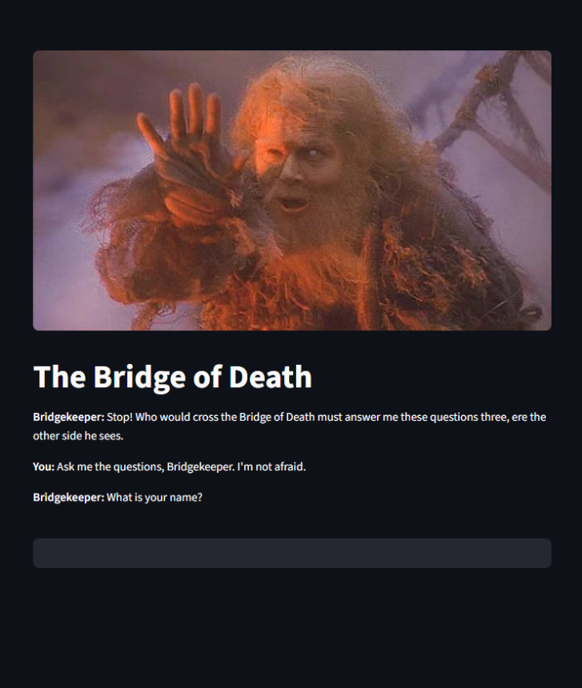

# 🧙 Bridgekeeper

**Stop! Who would cross the Bridge of Death must answer me these questions three, ere the other side he sees.**

A Monty Python-inspired AI-powered trivia game built with Streamlit.

## 🎮 Features

- AI-generated absurd questions
- Randomised outcomes based on answers
- Animated GIFs for user and Bridgekeeper deaths
- Persistent session history of who survived and who perished

<p align="center">
  
  
</p>
<p align="center">
  
  
</p>

## ⚙️ How to Run

Install dependencies:

```bash
pip install -r requirements.txt
```

Make sure [Ollama](https://ollama.com) is installed and running:

```bash
ollama run phi
```

Run the app:

```bash
streamlit run app.py
```

## 🚧 Roadmap

- Improve AI question variety and humour balance
- AI-generated response to the favourite colour question
- Optional web-based version (Flask + JS) for wider hosting
- Support for multiple AI models with in-app selection